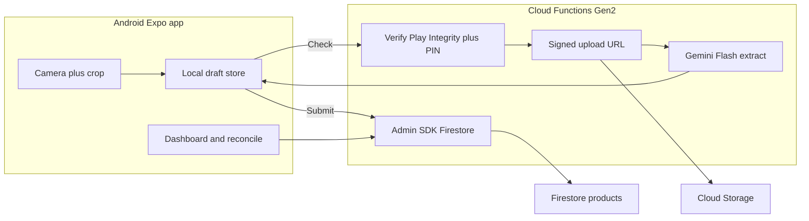

# Technical Solution Plan

Companion to [app-requirements.md](./app-requirements.md). This document is the implementation contract for v1 of the grocery inventory capture app. Functionality phases are in **§14**; the PRD test plan is **§15**.

**Stack baseline:** Expo SDK 57 (`expo-router`, `@expo/ui`, Reanimated, `expo-dev-client`). EAS project is already linked in `app.json` (`extra.eas.projectId`). Android application id: `com.babin78.myapp`.

---

## 1. Locked decisions

| Topic | Choice |
|---|---|
| Backend | Firebase: Cloud Storage, Firestore, Cloud Functions (2nd gen) |
| Login UI | None. Shopkeeper types a **username** used only for audit fields |
| Write gate | Play Integrity (`@expo/app-integrity`) **and** a store PIN (not Firebase Auth) |
| Duplicate barcode | Prompt: **Update existing** vs **Create new lot** |
| Capture | Flexible wizard: front photo required; extra photos optional; **Check** merges AI JSON |
| Platform | **Android first**; iOS later |
| Gemini | Called only from Cloud Functions (Flash). API key never in the APK |
| Export | On-device CSV and `.xlsx` via the native share sheet (WhatsApp / Drive / email) |

---

## 2. Assumptions

Correct these before implementation if they are wrong.

- One shop, one Firebase project.
- PIN is a single shared secret. Server stores `SHOP_PIN_HASH` in Functions secrets. Client stores the PIN in `expo-secure-store` after first entry.
- Client **cannot write Firestore directly**. Security rules: `allow write: if false`. Catalog reads go through a Cloud Function (Integrity + PIN) and may be cached on device after a successful fetch.
- Packaging text is **English and Hindi**. The Gemini prompt must say so.
- **Check** and **Submit** require network. Photos and draft JSON survive locally if the network drops.
- Header badge = **total catalogued product documents** (increments on successful ingest). Tapping it opens Reconciliation.
- Quantity, purchase amount, and selling-price edits happen on the **final review** screen only.
- `selling_price` defaults to `mrp` when empty.
- No `user_id` without Auth. Audit uses `username`, `created_at`, `updated_at`.
- Expo Go is not a v1 target (camera custom flow + Play Integrity need a **dev client** / production build).
- Web is not a v1 target.

---

## 3. Architecture



**Why Functions, not client Firestore + client Gemini:** there is no Firebase user. A PIN inside the APK is extractable. Play Integrity proves a genuine install of `com.babin78.myapp`. The PIN is accepted only server-side. Gemini billing stays off-device.

**Honest security limit:** a leaked PIN plus a genuine Play-installed APK can still write. That is accepted for v1 with no Auth module. Rotate the PIN via Functions env. No in-app PIN change in v1.

---

## 4. Firestore data model

### 4.1 Collection `products/{productId}`

| Field | Type | Required at Submit | Source |
|---|---|---|---|
| `product_item_id` | string \| null | no | AI / edit (barcode or packaging id) |
| `product_name` | string | **yes** | AI / edit |
| `product_category` | string | **yes** | AI / edit |
| `product_sub_category` | string \| null | no | AI / edit |
| `standard_size` | string \| null | no | AI / edit |
| `mrp` | number | **yes** | AI / edit |
| `selling_price` | number | no (defaults to MRP) | review screen |
| `mfd` | string \| null | no | AI / edit (ISO `YYYY-MM-DD`) |
| `expiry_date` | string \| null | no | AI / edit (ISO `YYYY-MM-DD`) |
| `quantity` | number | **yes** | review screen only |
| `image_urls` | string[] | no (at least one photo required in wizard) | Storage download URLs |
| `purchase_amount` | number \| null | no | review screen |
| `rack_no` | string \| null | no | review screen |
| `username` | string | **yes** | settings |
| `created_at` | timestamp | yes | server |
| `updated_at` | timestamp | yes | server |
| `lot_of_product_id` | string \| null | no | set when user chooses New lot |
| `source_photo_paths` | string[] | no | Storage object paths |

Category examples to seed the AI prompt and a picker: Eatables, Washing, Cleaning, Masala, Milk Products. Values remain editable free text.

### 4.2 Lots

- **Update existing:** PATCH the chosen `products/{id}`.
- **Create new lot:** INSERT a new document with the same `product_item_id` and `lot_of_product_id` pointing at the original (or the user-selected) product id.

### 4.3 Indexes

- Single-field index on `product_item_id` for duplicate lookup.
- Optional composite later: `product_category` + `created_at` (not required for v1 client-side grouping of ~2k docs).

### 4.4 Device-local state

| Key | Storage |
|---|---|
| username | `expo-secure-store` |
| PIN | `expo-secure-store` |
| in-progress draft (JSON + photo file URIs) | FileSystem cache + a small JSON file (not base64 in memory) |

Draft photos live under `cache/capture/{draftId}/`.

### 4.5 Wizard progress bar

Not a fixed stage count. Completion percent =

- 4 mandatory fields (`product_name`, `product_category`, `mrp`, `quantity`) plus
- at least one photo

Thin green bar anchored at the top of the capture stack.

---

## 5. Cloud Functions API

All mutating (and catalog-read) HTTPS functions (2nd gen):

1. Verify Play Integrity token (`@expo/app-integrity` standard request; server decodes via Play Integrity API).
2. Verify PIN against `SHOP_PIN_HASH`.
3. Rate-limit PIN failures; lock out after N failures per instance/IP window.

Do **not** use callable functions for the Integrity token exchange (recursive App Check / Integrity issues). Use HTTPS `onRequest`.

### 5.1 `POST /createUploadUrl`

**Body:** `{ draftId, contentType, purpose: "front" \| "extra" \| "crop" }`

**Returns:** `{ uploadUrl, storagePath }`

Client PUTs the JPEG to the signed URL. Storage writes are **only** via these URLs.

### 5.2 `POST /extractProduct`

**Body:** `{ draftId, storagePaths[], userEditedFields: string[], currentDraft }`

**Behavior:**

- Load image bytes from Storage (do not ask the client to send base64).
- Call Gemini Flash with a **strict JSON schema** (constrained decoding / response schema).
- Prompt: English + Hindi packaging; `null` if not visible; dates as ISO; barcode as digits when possible; category examples from the PRD.
- Merge: fill empty draft fields; **never overwrite keys listed in `userEditedFields`**.

**Returns:** `{ extracted, mergedDraft, warnings[] }`

### 5.3 `POST /findByBarcode`

**Body:** `{ product_item_id }`

**Returns:** `{ matches: ProductSummary[] }` (id, name, mrp, quantity, lot_of_product_id)

Used after `product_item_id` is first known. If `matches.length > 0`, the app shows **Update existing** vs **New lot**.

### 5.4 `POST /upsertProduct`

**Body:** `{ mode: "create" \| "patch" \| "new_lot", productId?, lotOfProductId?, record }`

**Server validates** mandatory fields, sets timestamps and `username`, writes via Admin SDK.

**Returns:** `{ productId, skuCount }`

### 5.5 `POST /listProducts`

**Body:** `{ }` or `{ product_item_id? }`

**Returns:** `{ products[], skuCount }`

v1: one full catalog pull is acceptable for 1,000–2,000 SKUs. Client caches the list for Reconciliation.

### Secrets (Functions)

- `GEMINI_API_KEY`
- `SHOP_PIN_HASH`
- Play Integrity / GCP cloud project number (as required by `@expo/app-integrity` `prepareIntegrityTokenProviderAsync`)

Gemini model: `gemini-2.5-flash` or the current Flash alias at implementation time.

---

## 6. Screen map (Expo Router)

Replace starter Home/Explore tabs. Routes live under `src/app/`. Shared UI stays in `src/components/`, domain logic in `src/` modules (not co-located inside `app/`).

```
src/app/
  _layout.tsx                 # root Stack (theme, hydration of username/PIN)
  (tabs)/
    _layout.tsx              # NativeTabs
    index.tsx                # inventory home: SKU badge, FAB +
    reconcile.tsx            # metrics + export
  capture/
    _layout.tsx              # modal stack, top progress bar
    index.tsx                # camera
    crop.tsx                 # optional crop / highlight
    review.tsx               # full editable form
    success.tsx              # checkmark, then reset to camera
  settings.tsx               # username + PIN
```

**Home:** FAB opens `capture` as a full-screen modal. Top-right badge shows `skuCount`; tap navigates to `(tabs)/reconcile`.

**Capture controls:** shutter, Add another photo, Check, Review. Front photo is required before Check/Review.

**Success:** short Reanimated checkmark, bump badge, clear draft, return to camera for the next SKU (PRD loop).

**Settings:** required before first Submit. Block Submit (and surface a prompt) if username or PIN is missing.

**UI libraries:** `@expo/ui` for form groups, menus, toggles; `expo-camera` + `expo-image-manipulator` for capture/crop. Use `FlatList` / FlashList only if the catalog list needs virtualization (~2k rows is usually fine on `FlatList`).

---

## 7. Capture and AI pipeline

1. User taps FAB → camera. Save each shot as a file under `cache/capture/{draftId}/` (never keep full-resolution base64 on the JS thread).
2. Resize/compress with `expo-image-manipulator` off the critical path (max edge ~1600px, JPEG ~0.8).
3. Optional crop: user draws a rect; Check sends the crop as the **primary** Gemini image and may attach the full frame as secondary context.
4. **Check** → `createUploadUrl` then PUT, then `extractProduct`. Update the on-screen draft immediately. User can edit before adding another photo or opening Review.
5. When `product_item_id` is present → `findByBarcode` → duplicate prompt if needed. Remember the chosen `mode` / `productId` on the draft.
6. Review: remaining fields; `selling_price` defaults to `mrp`. Quantity, purchase amount, rack number entered here.
7. Submit → `upsertProduct`. Disable double-submit. On failure, keep the draft, show inline error, retry.
8. Success animation → new empty draft → camera.

**v1 barcode:** Gemini only. No ML Kit unless extract quality is poor after a real-shop trial.

---

## 8. Security and Firebase rules

### Firestore

```
match /products/{id} {
  allow read, write: if false;
}
```

All access via Admin SDK in Functions.

### Storage

```
match /{allPaths=**} {
  allow read, write: if false;
}
```

Uploads only through signed URLs issued after Integrity + PIN.

### Client

- Integrity: `AppIntegrity.prepareIntegrityTokenProviderAsync(cloudProjectNumber)` at launch; `requestIntegrityCheckAsync(requestHash)` per Function call (hash of the request body).
- Debug builds (EAS `development` profile): Play Integrity debug / test path as documented for internal devices; production uses Play Integrity only.
- PIN brute-force protection on the server.

---

## 9. Offline and error states

| State | Behavior |
|---|---|
| No network on Check/Submit | Keep draft; inline error + Retry. Do not clear photos. |
| Integrity failure | Explain that a Play-signed install is required; do not fall back to open writes. |
| Gemini empty / invalid JSON | Show warning; leave fields empty; user can retake or type. |
| Duplicate prompt dismissed | Stay on review; do not submit until the user chooses. |
| Empty catalog | Designed empty state on Home and Reconcile with CTA to add first item. |
| Settings incomplete | Cannot Submit. |

Every data screen has **loading**, **error**, **empty**, and **content**. Failed save never wipes the draft.

---

## 10. Reconciliation and export

Computed on device from `listProducts` (2k docs is in-range):

- SKU count (document count)
- `sum(quantity)`
- cumulative cost: `sum(purchase_amount * quantity)` (treat null purchase as 0 or exclude; show which in UI)
- projected sales: `sum(selling_price * quantity)`
- estimated margin: projected sales − cumulative cost

Group by `product_category`. Optionally nest lots that share `product_item_id`.

Export: build CSV and `.xlsx` on device; `expo-sharing` share sheet. Columns match the PRD schema plus audit timestamps and `username`.

---

## 11. Native / EAS

- Stay on **dev client** (`eas.json` `development` profile already has `developmentClient: true`).
- Permissions: camera; others only as required by SDK 57 libraries actually used.
- Install packages with `npx expo install` (not raw npm) so versions match SDK 57.

**Illustrative packages:** `expo-camera`, `expo-image-manipulator`, `expo-file-system`, `expo-sharing`, `expo-secure-store`, `@expo/app-integrity`, Firebase JS client only if needed for Storage PUT to signed URLs (`fetch` is enough), spreadsheet library for `.xlsx`.

Functions live in a sibling `functions/` directory (or repo-standard Firebase layout), TypeScript, Admin SDK.

---

## 12. Module layout (when implementing)

Keep routes thin. Suggested modules (do not dump types/utils into `src/app/`):

- `src/lib/integrity.ts` — token prepare/request
- `src/lib/api.ts` — HTTPS Function client (PIN + integrity headers)
- `src/lib/draft-store.ts` — draft persistence and merge
- `src/lib/export.ts` — CSV / xlsx
- `src/types/product.ts` — shared Product / Draft types
- `src/components/capture/` — camera chrome, crop overlay, progress bar, duplicate prompt

---

## 13. Implementation sequence (summary)

1. Settings: username + PIN in SecureStore; gate Submit.
2. Firebase project + Functions skeleton: Integrity + PIN middleware, deny-all rules, secrets.
3. `createUploadUrl` + Storage signed PUT from a dummy JPEG.
4. Camera wizard: local files, compress, crop, progress bar (no AI yet).
5. `extractProduct` + merge rules + `userEditedFields`.
6. `findByBarcode` + Update vs New lot prompt.
7. `upsertProduct` + success animation + badge `skuCount`.
8. `listProducts` + Reconcile metrics + share-sheet export.
9. Android EAS development build; Play Integrity on a real device; harden debug vs production.

Each step is a **gate**: do not start the next phase until that phase’s tests in §15 pass (automated where listed, otherwise the device checklist).

---

## 14. Functionality development plan

Build on an **Android EAS development client** (not Expo Go). Each phase has a user-visible outcome, files to touch, and a definition of done. PRD IDs in parentheses map to §15.

### F0 — Project shell (navigation only)

**Outcome:** Shopkeeper can open Home, Settings, Reconcile (empty), and a Capture modal. Starter Home/Explore copy is gone.

**Work:** Root Stack + NativeTabs (`index`, `reconcile`); modal `capture` stack; `settings`. Hydrate SecureStore before routing decisions.

**Done when:** Cold start does not flash the wrong screen. FAB opens camera placeholder. Badge shows `0`.

**Validates:** PRD-WF-01 (entry), PRD-NAV (structure).

### F1 — Settings and submit gate

**Outcome:** Username and PIN persist across kills. Submit is impossible until both exist.

**Work:** `src/lib` SecureStore helpers; settings form (`@expo/ui` fields); gate on Review.

**Done when:** Relaunch restores values. Empty username or PIN blocks Submit with a clear prompt.

**Validates:** PRD-AUDIT (username), security PIN storage (not Gemini key).

### F2 — Firebase deny-all + Functions gate

**Outcome:** HTTPS functions reject missing/wrong PIN and missing Integrity token. Firestore/Storage client writes fail.

**Work:** `functions/` TypeScript; secrets; middleware; debug Integrity path for the internal EAS profile.

**Done when:** curl/Postman without PIN → 401/403. Direct Firestore write from a test client is denied.

**Validates:** PRD-SEC.

### F3 — Local capture wizard (no AI)

**Outcome:** Front photo required; extra photos optional; crop overlay; files only under `cache/capture/{draftId}/`; green progress bar tied to mandatory fields + photo, not a fake stage count.

**Work:** `expo-camera`, `expo-image-manipulator`, draft store. Compress off the UI thread. No base64 loops on JS.

**Done when:** Airplane mode: photos and draft JSON survive. UI stays smooth while compressing. Check/Review disabled until a front photo exists.

**Validates:** PRD-WF-01, PRD-WF-02 (local cache), PRD-PERF (no JS-thread image thrash).

### F4 — Upload + extract (Check)

**Outcome:** Check uploads via signed URL, Gemini returns schema JSON, draft fields fill, user edits are not overwritten on a later Check.

**Work:** `createUploadUrl`, `extractProduct`, merge + `userEditedFields`, English+Hindi prompt.

**Done when:** Two Checks: first fills name/MRP; user edits name; second Check (rear photo) fills dates and **does not** revert the name.

**Validates:** PRD-WF-02, PRD-SCHEMA (AI-populated fields), PRD-AI-JSON.

### F5 — Duplicate barcode prompt

**Outcome:** After `product_item_id` is known, matches from `findByBarcode` show Update existing vs New lot. Dismissing does not submit.

**Done when:** Same barcode on a second SKU cannot be saved until a choice is made. New lot sets `lot_of_product_id`. Patch updates the same doc.

**Validates:** locked duplicate rule (not in original PRD; regression for catalog integrity).

### F6 — Review, validation, ingest, loop

**Outcome:** Review form has every schema field. Quantity / purchase / selling price / rack only here. `selling_price` defaults to MRP. Submit → Firestore via `upsertProduct` → checkmark → badge +1 → camera reset with empty draft.

**Done when:** Missing mandatory fields (`product_name`, `product_category`, `mrp`, `quantity`) block Submit. Failed Submit keeps draft. Double-tap Submit creates one document. Badge matches `skuCount`.

**Validates:** PRD-WF-03, PRD-WF-04, PRD-SCHEMA, PRD-AUDIT (`created_at` / `updated_at` / username).

### F7 — Reconciliation and export

**Outcome:** Badge opens Reconcile. Totals: SKU count, `sum(quantity)`, cost, projected sales, margin. Group by `product_category`. Export CSV and `.xlsx` through the share sheet.

**Work:** `listProducts`, cache, `src/lib/export.ts`. Null `purchase_amount` treated as 0 (labeled in UI).

**Done when:** A fixture of N products produces spreadsheet columns matching the PRD plus audit fields. Share sheet appears on device. Empty catalog is a designed empty state.

**Validates:** PRD-WF-05, PRD-SCALE (list of 1–2k still usable).

### F8 — Hardening

**Outcome:** Production Integrity (no debug provider). PIN rate-limit. Loading/error/empty on every data screen. ~2k-row list remains usable.

**Done when:** §15 exit criteria (including shop trial sample) pass.

**Dependency graph:** F0 → F1 → F2 → F3 → F4 → F5 → F6 → F7 → F8. F3 can overlap F2 after the Functions skeleton exists, but Check (F4) needs F2+F3.

---

## 15. Test plan (validate the PRD)

**Test environments**

| Env | Build | Backend | Integrity |
|---|---|---|---|
| Unit / Function | Node | emulators or mocked Gemini | skipped (inject gate) |
| Device-dev | EAS `development` | Firebase project (dev) | debug / test tokens |
| Shop-trial | EAS `preview` or production | same or staging Firebase | Play Integrity |

**Do not** use Expo Go for camera+Integrity acceptance.

**Gemini:** unit tests use a **fixture JSON** (no live billed calls). Device-dev uses live Flash on a small photo set. Shop-trial uses real packaging (English + Hindi).

### 15.1 Requirement traceability

| ID | PRD / locked rule | Phase | How we prove it |
|---|---|---|---|
| PRD-SCHEMA | All listed product fields; `*` mandatory | F6 | Review form + server reject incomplete Submit; export columns |
| PRD-SCHEMA-SP | `selling_price` defaults to MRP, editable on review | F6 | Leave selling price blank → stored equals MRP; edit persists |
| PRD-WF-01 | FAB → staged camera; extra photos; crop; green progress | F0, F3 | Device checklist |
| PRD-WF-02 | Local temp files; Check → Storage → Gemini JSON; edit before continue | F3, F4 | Files exist on disk; merge test |
| PRD-WF-03 | Review aggregates; qty / purchase / SP; persist | F6 | Device + Firestore Admin read |
| PRD-WF-04 | Checkmark; badge; reset camera loop | F6 | Device checklist |
| PRD-WF-05 | Badge → reconcile; totals; CSV/xlsx share | F7 | Spreadsheet open in Excel/Sheets; share sheet |
| PRD-AUDIT | username + timestamps (no `user_id`) | F1, F6 | Firestore document inspection |
| PRD-SCALE | 1,000–2,000 SKUs | F7, F8 | Seeded catalog performance |
| PRD-PERF | Image work not blocking UI | F3 | No freeze during compress; no base64 in draft JSON |
| PRD-SEC | Strict access; Gemini key off-device | F2, F8 | Rules test + APK string scan |
| DUP-LOT | Update vs new lot | F5 | Two docs vs one patched doc |
| LOCK-AND | Android first | all | Acceptance on Android device only for v1 |

### 15.2 Automated tests (write with the matching phase)

**Draft merge (`src/lib/draft-store`)**

- Empty fields fill from AI; `userEditedFields` never overwritten.
- Progress percent: 0 photos → 0%; photo + 4 mandatories → 100%.
- `selling_price` default when `mrp` set and selling empty.

**Export (`src/lib/export`)**

- CSV header = schema + `username`, `created_at`, `updated_at`.
- Lots: two rows same `product_item_id`, different ids, one with `lot_of_product_id`.
- Metrics match a golden fixture (SKU count, qty sum, cost, sales, margin).

**Functions (emulator)**

- Wrong PIN / no Integrity → 403; lockout after N failures.
- `upsertProduct` without `product_name` / `product_category` / `mrp` / `quantity` → 400.
- `extractProduct` merge with mocked Gemini.
- `findByBarcode` returns matches; empty string → empty list.
- Signed URL PUT succeeds; unsigned PUT to Storage path fails.

**Rules**

- Firestore `products` client write denied; Storage unauthenticated write denied.

### 15.3 Device / EAS checklist (must pass before calling v1 done)

Run on a physical Android phone with the dev client unless noted.

**Capture loop**

1. Settings: set username + PIN; kill app; values remain.
2. FAB opens camera; progress bar visible at top (green).
3. Cannot Check/Review with zero photos.
4. Take front photo → file under app cache, not Photos gallery as the only copy.
5. Crop a date block; Check returns dates more often than an uncropped rear shot (spot-check 5 packs).
6. Add extra photo; second Check merges without wiping user edits.
7. Airplane mode: Check shows error + Retry; photos remain; going online retries successfully.
8. Hindi-dominant pack and English pack both produce usable `product_name` (manual score: usable vs garbage).
9. Duplicate barcode → prompt; Update changes quantity on same id; New lot creates second doc.
10. Review: fill quantity, purchase, rack; selling price prefilled from MRP.
11. Submit without quantity → blocked. Submit OK → checkmark → badge +1 → camera empty.
12. Double-tap Submit → one new document.
13. Failed network on Submit → draft kept; retry succeeds without duplicate if first write actually landed (idempotency / disable button).

**Reconcile / export**

14. Badge count equals Firestore document count.
15. Badge opens Reconcile; category groups and four money/qty metrics match a spreadsheet calculated from the same export.
16. Export CSV and xlsx; share sheet lists WhatsApp (or another installed target). Vendor can open the file.

**Security / native**

17. APK / source: no `GEMINI_API_KEY`. Functions-only.
18. Play Integrity failure (modified/sideloaded if available) does not write catalog.
19. Catalog of ~2,000 seeded docs: Reconcile opens in a few seconds; scroll does not lock the UI.

### 15.4 Shop-trial protocol (requirement validation, not unit tests)

Goal of the PRD: digitize **1,000–2,000** items faster and with fewer typos than typing.

1. Pick **30 real SKUs** spanning categories in the PRD (eatables, masala, milk, washing, cleaning).
2. For each: capture front + at least one extra (dates/barcode) when needed; Check; correct on Review; Submit.
3. Score per field: `product_name`, `product_item_id`, `mrp`, `standard_size`, dates — **correct / wrong / missing**.
4. **Pass bar for AI assist:** name + MRP usable (correct or one-tap fix) on **≥80%** of the 30. Barcode and dates are best-effort; failures must be easily correctable on Review.
5. Time the 30-SKU loop (camera to success). Compare to a 5-SKU manual-typing baseline. Trial is **informative** for v1; do not block F6 on beating typing until the 80% field bar is met.
6. Export the 30 rows; shopkeeper confirms the file is acceptable for the billing vendor.

### 15.5 Exit criteria (v1)

- All automated tests in §15.2 green on CI or local emulator.
- Device checklist §15.3 items 1–19 pass on one Android device.
- Shop-trial §15.4 sample meets the 80% name+MRP bar and produces a shareable CSV/xlsx.
- Deny-all rules + PIN/Integrity gate verified.
- No Gemini key in the client bundle.

---

## 16. Out of scope for v1

- iOS, Expo Go, web app
- Firebase Auth / staff roles / multi-shop
- Client-side Gemini or open Firestore/Storage rules
- WhatsApp Business API (share sheet only)
- GST, billing checkout, automatic stock decrement
- Hardware barcode scanners / ML Kit (unless Gemini barcode quality fails in trial)
- In-app PIN rotation UI
- Firestore aggregation pipelines
